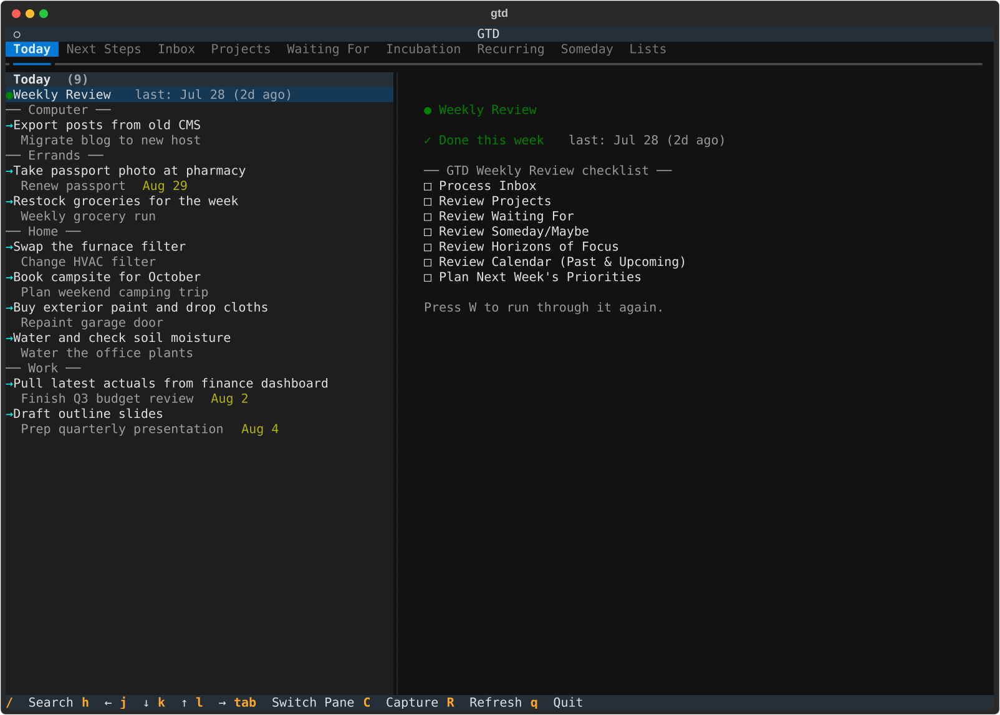
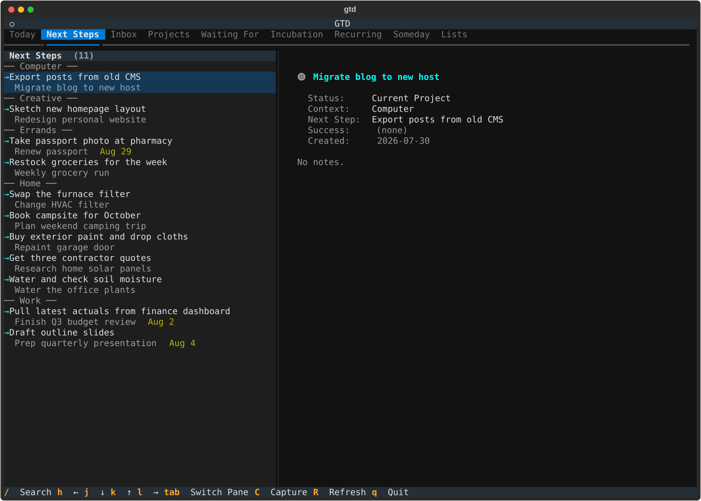
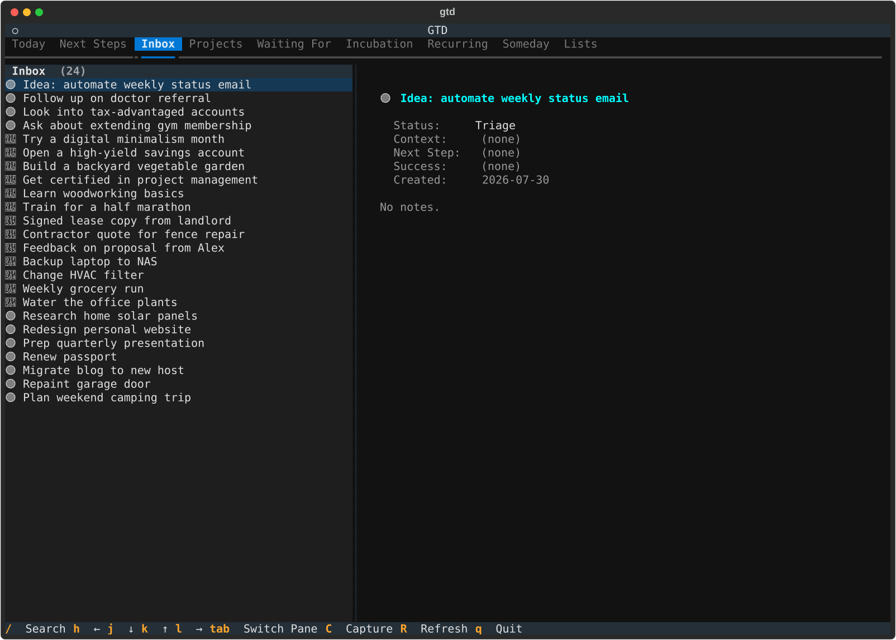
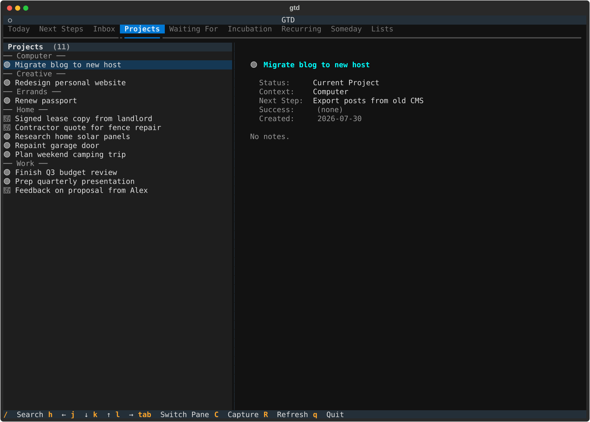
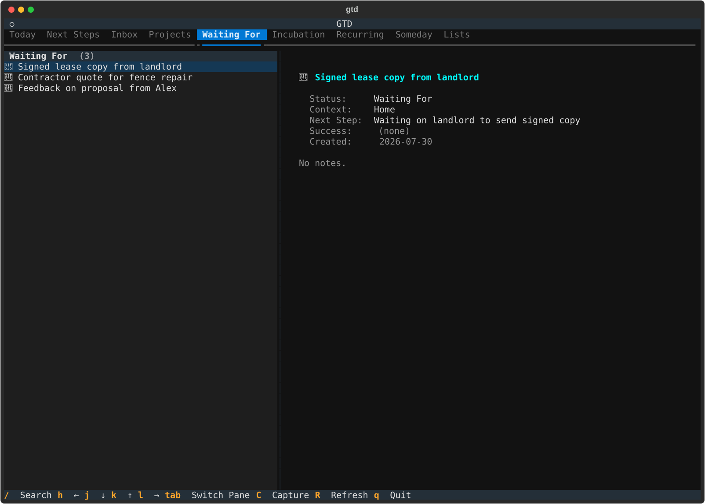
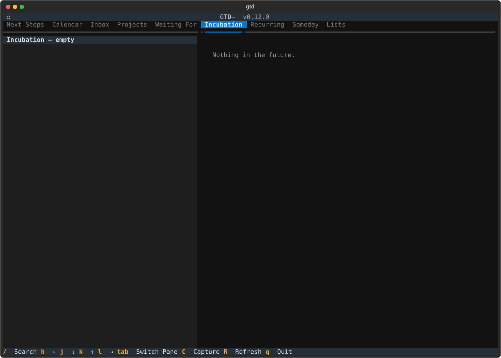
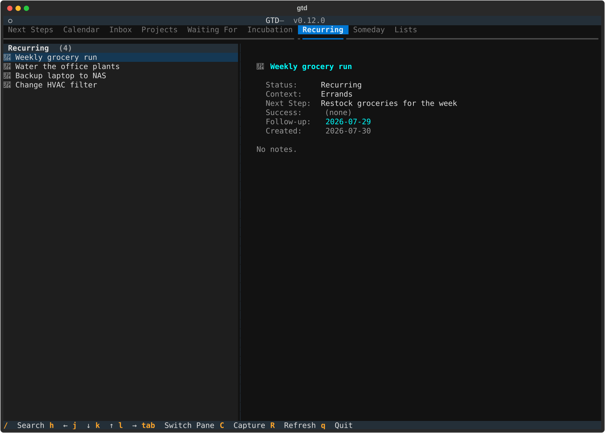
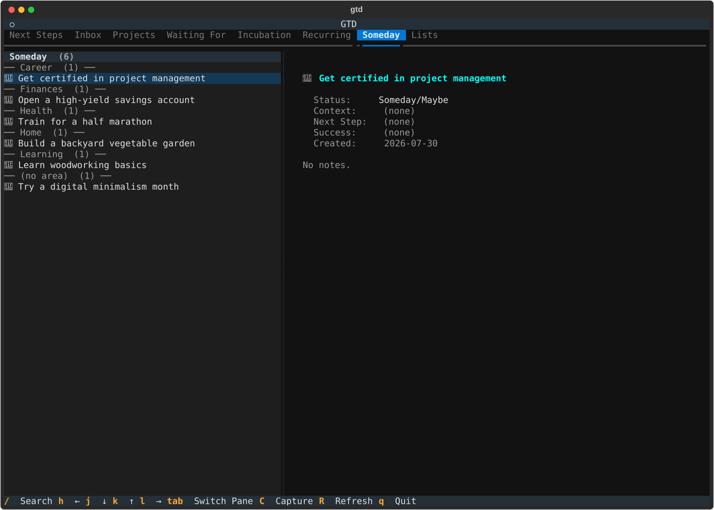
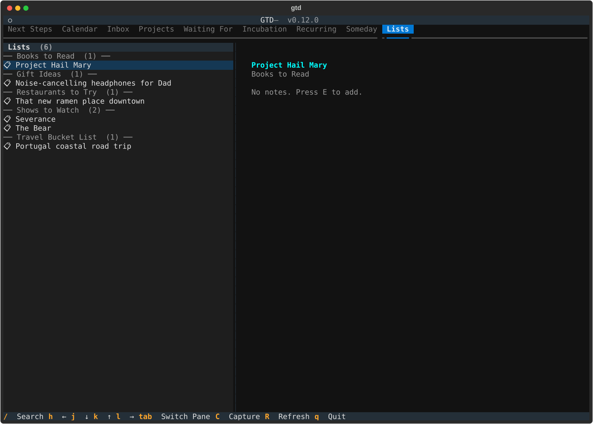

# The Getting Things Done Terminal User Interface

A TUI/CLI/API for personal productivity built around [GTD (Getting Things Done)](https://gettingthingsdone.com/).

## What it does

- Capture items to an inbox and triage them into projects
- Track projects with contexts, next actions, and follow-up dates
- Log completions and auto-reschedule recurring items
- Defer, snooze, and review Someday/Maybe lists
- Filter by context for focused work sessions

## Screenshots



*Today — the always-present Weekly Review reminder plus everything actionable right now, grouped by context.*

<details>
<summary>More tabs</summary>



*Next Steps — every current project's next action, grouped by context.*



*Inbox — unprocessed captures waiting to be triaged.*



*Projects — all Current Project and Waiting For items.*



*Waiting For — items delegated and waiting on someone else.*



*Incubation — current projects snoozed past today's follow-up date.*



*Recurring — habits and chores that repeat on their own schedule.*



*Someday — parked ideas, grouped by Area of Focus.*



*Lists — books to read, restaurants to try, and other reference lists, grouped by category.*

</details>

*(Screenshots use fictional demo data — see `scripts/seed_demo_data.py` and `scripts/capture_screenshots.py` to regenerate them.)*

## Requirements

- Python 3.12+
- [fzf](https://github.com/junegunn/fzf) (for interactive menus)
- A [Notion integration token](https://developers.notion.com/) (for `gtd`)

## Installation

```bash
cd gtd
uv sync
uv pip install -e .
```

This installs the `gtd` command.

## Usage

### Default: the TUI

```bash
gtd
```

With no subcommand, `gtd` launches the Textual TUI — tabs for Today, Next
Steps, Inbox, Projects, Waiting For, Incubation, Recurring, Someday, and
Lists, plus a guided Weekly Review. This is the primary interface.

### CLI subcommands

Each of these also works standalone, e.g. for scripting or quick one-offs
without opening the TUI:

<!-- BEGIN CLI -->
| Command | Description |
| --- | --- |
| `gtd init` | Set up or upgrade the GTD Notion database. |
| `gtd triage` | Interactively process items needing triage. |
| `gtd filter` | Filter by context name (e.g. gtd filter Phone). |
| `gtd today` | Show actionable items for today. |
| `gtd snooze` | Snooze today's items until tomorrow. |
| `gtd log` | Log a note and reschedule a recurring item. |
| `gtd done` | Mark a current project as done (archives it). |
| `gtd review` | Run the GTD weekly review ritual. |
| `gtd update` | Update fields on an existing project. |
| `gtd defer` | Defer a project by setting a follow-up date. |
| `gtd someday` | Review Someday/Maybe items — keep, activate, or drop. |
| `gtd capture` | Quick-capture an item to the GTD inbox. |
| `gtd areas` | Manage Areas of Focus (Notion 'Area' select options). |
| `gtd areas add` | Add a new Area of Focus. |
| `gtd areas remove` | Remove an Area of Focus. |
| `gtd contexts` | Manage GTD contexts (Computer, Home, Phone, etc.). |
| `gtd contexts add` | Add a new context. |
| `gtd contexts remove` | Remove a context. |
| `gtd contexts rename` | Rename a context and update all items with that context. |
| `gtd dump` | Rapid-fire brain dump — capture everything, triage later. |
| `gtd config` | View or set GTD configuration. |
| `gtd config notes-editor` | Set notes editor: inline (TUI TextArea) or external (uses $EDITOR). |
| `gtd fzf` | Launch the legacy fzf-based interactive GTD menu. |
| `gtd tui` | Launch the interactive GTD TUI. |
| `gtd api` | Start the GTD HTTP API server (requires: pip install gtd[api]). |
<!-- END CLI -->

### Legacy fzf menu

```bash
gtd fzf
```

An older fzf-driven menu predating the TUI, kept for anyone who prefers it:

<!-- BEGIN MENU -->
| Category | Action |
| --- | --- |
| Do | Today |
| Do | Log & Reschedule |
| Do | Snooze until tomorrow |
| Do | Capture new item |
| Do | Brain dump |
| Do | Triage inbox |
| Manage | Update project |
| Manage | Defer project until date |
| Manage | Waiting For |
| Manage | Mark done (delete) |
| Review | Weekly Review |
| Review | Review Someday/Maybe |
| View | View all projects |
| View | Filter by context |
<!-- END MENU -->

## HTTP API

A small Flask app (`gtd api`) exposes GTD operations over HTTP, primarily so
you can drive `gtd` from **iOS Shortcuts** (or any other HTTP client) without
opening a terminal — capture a thought, check today's actionable items, or
triage the inbox from your phone.

There's no central server in the loop: you run this yourself, against your own
Notion integration and database. Your GTD data lives in your Notion account under
your own token.


**Install**: `uv pip install "gtd[api]"`
**Run**: `gtd api` (default `0.0.0.0:8000`) or `gtd api --port 9000`
**Auth**: Bearer token — set `GTD_API_KEY` on the server, then pass
`Authorization: Bearer <key>` on every request.

<!-- BEGIN API MENU -->
| Method | Path | Description |
| --- | --- | --- |
| `POST` | `/capture` | Add an item to the inbox. Body: {"header": "..."}. |
| `GET` | `/contexts` | Get active contexts. |
| `GET` | `/inbox` | Get all Triage entries (inbox). |
| `GET` | `/list-categories` | Return canonical list categories from Notion (for debugging/UI use). |
| `GET` | `/list/<category>` | Get all entries in a specific list category. |
| `GET` | `/next-steps` | Get actionable next steps, optionally filtered by context. |
| `GET` | `/triage-schema` | Get schema for triage workflow: statuses and contexts per status. |
| `POST` | `/triage/<page_id>` | Atomically triage an entry with full data. |
<!-- END API MENU -->

## Updating this README

The fzf menu table, CLI command table, project tree, and HTTP API table above
are all extracted from source: `cli.py`'s `menu_items` list and click command
tree, module docstrings under `src/gtd/` and `scripts/`, and the
`@app.get`/`@app.post`/... routes in `api.py`, respectively. After changing
any of these, regenerate everything:

```bash
python scripts/update_readme.py
```

A pre-commit hook (`sync-readme`) runs this automatically whenever any
`src/gtd/**/*.py`, `scripts/**/*.py`, or `README.md` file changes, so these
sections shouldn't drift in practice.

## Data storage

- **GTD**: Notion database (configured via `gtd init` or `NOTION_NOTES_TOKEN` / `NOTION_PROJECTS_DB_ID` env vars)
- **Weekly review state, Areas of Focus, list categories**: JSON files in `~/.local/share/gtd/`

## Project structure

<!-- BEGIN TREE -->
```
src/gtd/
├── api.py          # Thin Flask wrapper around GTD Notion operations for iOS Shortcuts.
├── cli.py          # GTD CLI — David Allen's Getting Things Done powered by Notion.
├── gtd_tui.py      # Unified GTD TUI.
├── storage.py      # Local JSON I/O for weekly review state and habit dates.
├── tui.py          # Shared Textual widgets and modals for the GTD TUI.
├── ui.py           # fzf helpers, prompts, and formatting shared across CLI commands.
└── notion/
    ├── capture.py  # Quick-capture items to the GTD inbox (Notion Projects table).
    ├── client.py   # Notion REST API client (httpx).
    ├── commands.py # Manage commands: mark done, defer, waiting for, notion dispatch.
    ├── config.py   # Configuration management for GTD CLI.
    ├── display.py  # Display formatting for Notion entries.
    ├── entries.py  # Entry listing, selection, and field editing.
    ├── init.py     # Database initialization and schema management for GTD CLI.
    ├── log.py      # Log, reschedule, and recurring-item utilities.
    ├── models.py   # Parse Notion page properties into simple data structures.
    ├── review.py   # Weekly review and Someday/Maybe review flows.
    ├── schema.py   # GTD Notion database schema definition — single source of truth.
    ├── today.py    # Today view and snooze commands.
    └── triage.py   # Interactive triage flow for processing inbox items.
scripts/
├── capture_screenshots.py    # Capture SVG screenshots of every GTD TUI tab, for docs/README.
├── check_commit_msg_early.py # Validate the commit message during the *pre-commit* stage, not commit-msg.
├── seed_demo_data.py         # Create/reseed a demo GTD Notion database with fake data, for screenshots.
└── update_readme.py          # Update README.md menu, CLI, tree, and HTTP API sections from source.
```
<!-- END TREE -->
